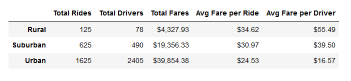
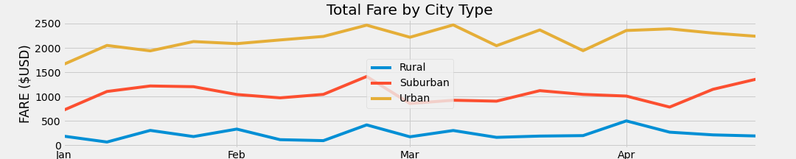

# PyBer_Analysis

## Overview
The purpose of this project is to analyze the relationships between the types of city (rural, suburban, and urban) and the number of riders and drivers in those cities in order to improve access to ridesharing services and determine affordability for underserved neighborhoods. 

## Results 

#### Summary DataFrame

- In rural and suburban areas, there are fewer drivers than rides given, which may indicate an underserved population.
- There is a noticeable difference in average fare per driver in urban areas versus rural and suburban, with urban Pyber drivers earning less per ride and significantly less per driver.
- When considering gross profit, though, urban areas are a much bigger money-maker for the company than rural and suburban areas, even combined. (see line graph below)
- The line graph also shows that trends are broadly similar across the three city types (they generally increase or decline during the same time periods).

## Summary: 
Based on these results, we suggest the following three business recommendations to the CEO for addressing any disparities among the city types. 
1. Incentivize more drivers in rural areas
2. Incentivize more drivers in suburban areas
3. Raise rates for urban riders